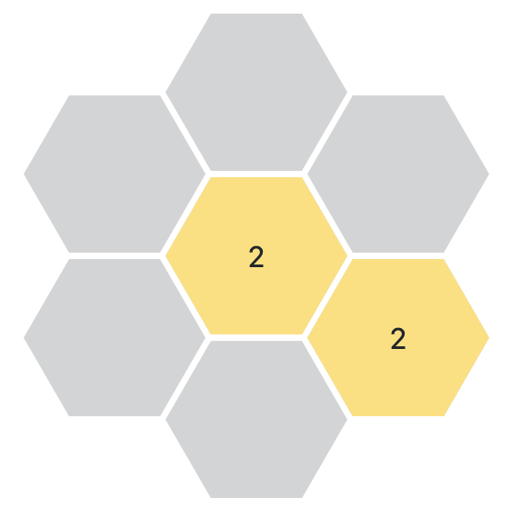

<p align="center">
  
</p>

# Hexagonal 2048

### Description:

Initially, the idea was taken from the Evolution TypeScript bootcamp task.

Massive thanks to **Amit Patel** from **Red Blob Games** for creating this [amazing article](https://www.redblobgames.com/grids/hexagons/) that helped a ton!

This repo contains the client side of my implementation of the Hexagonal 2048 game.

If you are interested in the server-side implementation, please visit [ng-hex-2048-server](https://github.com/serge-st/ng-hex-2048-server)

### Additional information:

As a `React` developer, I decided to take on this challenge and see if I could build this app at all, as well as test my learning skills and build it using `Angular`.

I wanted it to be a pure web-based game, intending to use `HTML` elements to draw the shapes and basic `CSS` transitions to make the game more appealing to the eye.

Usually, `HTML` is used to display something like:

```html
<h1>This is a header</h1>
<p>This is a paragraph</p>
```

Here `HTML` is used to display hexagons on a grid, where each hexagon is a separate `HTML` element:



To move the game forward the application uses HTML requests, just like any other web app.

```js
fetch('http://localhost:3000/hex-grid-management/1', {
  method: 'POST',
  headers: {
    'Content-Type': 'application/json',
  },
  body: JSON.stringify([]),
})
  .then((response) => response.json())
  .then((data) => console.log(data));
```

Received data is then set into the app state. After the next move is made, a new data array (containing the latest user move and modified hexagons) is created and sent to the server in the body. In turn, the server returns an array of new hexagons to be added to the grid.

This process goes on until the user manages to merge hexagons enough times to get at least one of them to have the value of `2048`.

If none of the hexagons have the value of `2048` and no more moves are left - the game is lost.

### Drawing Hexagons:

Again, a big shout-out to **Amit Patel** from **Red Blob Games**, without his website it would probably have taken me ages to understand how to build hexagonal grids.

Remember, our [ng-hex-2048-server](https://github.com/serge-st/ng-hex-2048-server) spits out data of this kind:

```json
[
  { "q": 0, "r": 0, "s": 0, "value": 2 },
  { "q": 1, "r": 0, "s": -1, "value": 2 }
]
```

Inside the `GridComponent` we have a few parameters that help to determine the grid dimensions, based on our desired hexagon width and the gap between hexagons (hexagon height is calculated automatically: `√3 × (hexWidth ÷ 2)`).

After the grid dimensions are known, we can determine the grid center and calculate pixel offset for hexagons.

Then, we pass hexagon coordinates and the offset into our `HexagonComponent`s.

In turn, the `HexagonComponent` component converts its coordinates (`q`, `r`, `s`) into pixel values using the formula for flat-topped hexagons kindly provided on the [RedBlobGames website](https://www.redblobgames.com/grids/hexagons/implementation.html):

```cpp
const Orientation layout_flat = Orientation(
  3.0 / 2.0, 0.0, sqrt(3.0) / 2.0, sqrt(3.0),
  2.0 / 3.0, 0.0, -1.0 / 3.0, sqrt(3.0) / 3.0,
  0.0
);
```

Then we need to add the `offset` and don't forget to _mind the gap_ 🚇🤓

After adding an `absolute` position to our hexagon `HTML` elements, and setting `x` and `y` pixel coordinates to the `top` and `left` `CSS` properties, we now have a hexagonal grid in the browser 🥳

### Installation:

```bash
pnpm install --frozen-lockfile
```

### Running the app:

```bash
pnpm start
```

🤓 Please note that it expects [ng-hex-2048-server](https://github.com/serge-st/ng-hex-2048-server) running on `localhost:3000`

---

**Author:** [Serge Stecenko](https://www.linkedin.com/in/serge-stecenko/)

**Link:** The game is available on my website: [hex2048.stetsen.co](https://hex2048.stetsen.co/)
